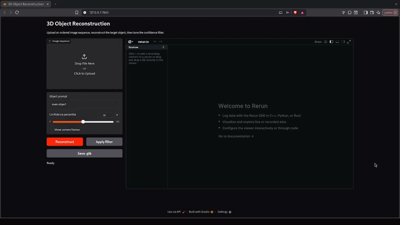

<div align="left">

# 3D Object Reconstruction

**3D object reconstruction from image.**

[](https://www.python.org/downloads/release/python-3100/)
[](https://rerun.io/)
[](https://www.gradio.app/)

<br />



<br />

</div>

## Overview

This repo combine VGGT and SAM3 to produce 3D object from images. It includes a complete inference pipeline alongside an interactive Gradio web UI and Rerun 3D visualization.

---

## Installation

Make sure to include submodules for the VGGT code.

```bash
git clone --recurse-submodules https://github.com/itsmeaboud/3d-object-recon.git
cd 3d-object-recon

# install main dependencies
pip install -r requirements.txt

# install the bundled VGGT package in editable mode (without installing its deps)
pip install -e third_party/vggt --no-deps
```

> ⚠️ **Note:** We recommend at least 24 GB of RAM to run both models comfortably.

---

## Model Weights

### 1. VGGT Weights
The weights will download automatically on the first run, but you must be authenticated with Hugging Face. Make sure you are logged in.


### 2. SAM3 Weights
You need to request access manually to get the SAM3 checkpoints.
1. Request access through (https://huggingface.co/facebook/sam3.1).
2. Place the downloaded file at: `weights/sam3.1_multiplex.pt`

## Usage

### Using the Web UI

```bash
python demo.py
```
Upload your images, and the Rerun viewer will launch automatically to display the 3D results.

.glb output are written to the `data/output/` folder.

---

## Progress Checklist

- [x] Release 3D object reconstruction pipeline
- [ ] Run the two models fully asynchronously

---

## Acknowledgements

This work builds on VGGT and SAM3:

- **VGGT:** Visual Geometry Grounded Transformer
- **SAM3:** Segment Anything with Concepts


```bibtex
@inproceedings{wang2025vggt,
  title={VGGT: Visual Geometry Grounded Transformer},
  author={Wang, Jianyuan and Chen, Minghao and Karaev, Nikita and Vedaldi, Andrea and Rupprecht, Christian and Novotny, David},
  booktitle={Proceedings of the IEEE/CVF Conference on Computer Vision and Pattern Recognition},
  year={2025}
}
```
```bibtex
@inproceedings{
carion2026sam,
title={{SAM} 3: Segment Anything with Concepts},
author={Nicolas Carion and Laura Gustafson and Yuan-Ting Hu and Shoubhik Debnath and Ronghang Hu and Didac Suris Coll-Vinent and Chaitanya Ryali and Kalyan Vasudev Alwala and Haitham Khedr and Andrew Huang and Jie Lei and Tengyu Ma and Baishan Guo and Arpit Kalla and Markus Marks and Joseph Greer and Meng Wang and Peize Sun and Roman R{\"a}dle and Triantafyllos Afouras and Effrosyni Mavroudi and Katherine Xu and Tsung-Han Wu and Yu Zhou and Liliane Momeni and RISHI HAZRA and Shuangrui Ding and Sagar Vaze and Francois Porcher and Feng Li and Siyuan Li and Aishwarya Kamath and Ho Kei Cheng and Piotr Dollar and Nikhila Ravi and Kate Saenko and Pengchuan Zhang and Christoph Feichtenhofer},
booktitle={The Fourteenth International Conference on Learning Representations},
year={2026},
url={https://openreview.net/forum?id=r35clVtGzw}
}
```
